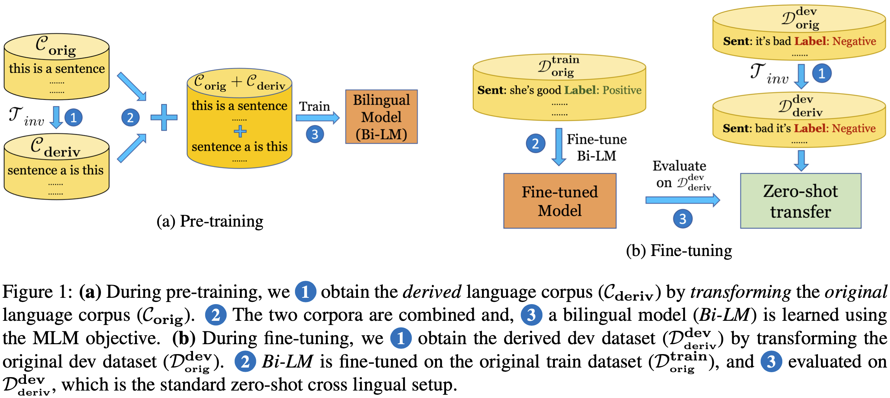

# When is BERT Multilingual? Isolating Crucial Ingredients for Cross-lingual Transfer

This repository contains code for our paper titled ["When is BERT Multilingual? Isolating Crucial Ingredients for Cross-lingual Transfer"](https://arxiv.org/pdf/2110.14782.pdf). [[arXiv]](https://arxiv.org/pdf/2110.14782.pdf) [[Blog]]()

## Table of contents
1. [Paper in a nutshell](#nutshell)
1. [Installation](#installation)
1. [Data and models](#data)
1. [Repository usage](#usage)
1. [Links to experiments and results](#wb)
1. [Citation](#citation)

## Paper in a nutshell <a name="nutshell"></a>
While recent work on multilingual language models has demonstrated their capacity for cross-lingual zero-shot transfer on downstream tasks, there is a lack of consensus in the community as to what shared properties between languages enable such transfer.
Analyses involving pairs of natural languages are often inconclusive and contradictory since languages simultaneously differ in many linguistic aspects.
In this paper, we perform a large-scale empirical study to isolate the effects of various linguistic properties by measuring zero-shot transfer between four diverse natural languages and their counterparts constructed by modifying aspects such as the script, word order, and syntax.
Among other things, our experiments show that the absence of sub-word overlap significantly affects zero-shot transfer when languages differ in their word order, and there is a strong correlation between transfer performance and word embedding alignment between languages (e.g., Spearman's R=0.94 on the task of NLI).
Our results call for focus in multilingual models on explicitly improving word embedding alignment between languages rather than relying on its implicit emergence.



## Installation instructions <a name="installation"></a>

1.  **Step 1:** Install from the conda `.yml` file.
``` bash
conda env create -f installation/multilingual.yml
```
2. **Step 2:** Install `transformers` in an editable way.
``` bash
pip install -e transformers/
pip install -r transformers/examples/language-modeling/requirements.txt
pip install -r transformers/examples/token-classification/requirements.txt
```

## Repository usage <a name="usage"></a>

For the commands we used to get the reported numbers in the paper, [click here](#wb).
[This file](Steps.md) contains common instructions used.
[This file](run_experiments.py) can automatically generate commands for your use case.

### Bilingual pre-training
1. **For bilingual pre-training on original and derived language pairs**, use the flag `--invert_word_order` for the _Inversion_ transformation, `--permute_words` for _Permutation_  and `--one_to_one_mapping` for _Transliteration_. Example command for bilingual pre-training for English with _Inversion_ transformation to create the derived language pair.
``` bash
nohup  python transformers/examples/xla_spawn.py --num_cores 8 transformers/examples/language-modeling/run_mlm_synthetic.py --warmup_steps 10000 --learning_rate 1e-4 --save_steps -1 --max_seq_length 512 --logging_steps 50 --overwrite_output_dir --model_type roberta --config_name config/en/roberta_8/config.json --tokenizer_name config/en/roberta_8/ --do_train --do_eval --max_steps 500000 --per_device_train_batch_size 16 --per_device_eval_batch_size 16 --train_file ../../bucket/pretrain_data/en/train.txt --validation_file ../../bucket/pretrain_data/en/valid.txt --output_dir ../../bucket/model_outputs/en/inverted_order_500K/mlm --run_name inverted_en_500K_mlm --invert_word_order --word_modification add &
```
1. **For _Syntax_ transformations**, the train file used in the following command (`synthetic_dep_train-fr~en@N~en@V.txt`) means that it is the concatenation of French corpus with French modified to English verb and noun order (`fr~en@N~en@V`).
``` bash
nohup python transformers/examples/xla_spawn.py --num_cores 8 transformers/examples/language-modeling/run_mlm_synthetic.py --warmup_steps 10000 --learning_rate 1e-4 --save_steps -1 --max_seq_length 512 --logging_steps 50 --overwrite_output_dir --model_type roberta --config_name config/fr/roberta_8/config.json --tokenizer_name config/fr/roberta_8/ --do_train --do_eval --max_steps 500000 --per_device_train_batch_size 16 --per_device_eval_batch_size 16 --train_file ../../bucket/pretrain_data/fr/synthetic/synthetic_dep_train-fr~en@N~en@V.txt --validation_file ../../bucket/pretrain_data/fr/synthetic/synthetic_dep_valid-fr~en@N~en@V.txt --output_dir ../../bucket/model_outputs/fr/syntax_modif_en/mlm --run_name fr_syntax_modif_en_500K_mlm &
```
1. **For composed transformations**, apply multiple transformations by using multiple flags, e.g., `--one_to_one_mapping --invert_word_order`.
```bash
nohup python transformers/examples/xla_spawn.py --num_cores 8 transformers/examples/language-modeling/run_mlm_synthetic.py --warmup_steps 10000 --learning_rate 1e-4 --save_steps -1 --max_seq_length 512 --logging_steps 50 --overwrite_output_dir --model_type roberta --config_name config/en/roberta_8/config.json --tokenizer_name config/en/roberta_8/ --do_train --do_eval --max_steps 500000 --per_device_train_batch_size 16 --per_device_eval_batch_size 16 --train_file ../../bucket/pretrain_data/en/train.txt --validation_file ../../bucket/pretrain_data/en/valid.txt --output_dir ../../bucket/model_outputs/en/one_to_one_inverted/mlm --run_name en_one_to_one_inverted --one_to_one_mapping --invert_word_order --word_modification add &
```
1. **Using different domains for the _original_ and _derived_ language**.
``` bash
nohup python transformers/examples/xla_spawn.py --num_cores 8 transformers/examples/language-modeling/run_mlm_synthetic_transitive.py --warmup_steps 10000 --learning_rate 1e-4 --save_steps -1 --max_seq_length 512 --logging_steps 50 --overwrite_output_dir --model_type roberta --config_name config/en/roberta_8/config.json --tokenizer_name config/en/roberta_8/ --do_train --do_eval --max_steps 500000 --per_device_train_batch_size 16 --per_device_eval_batch_size 16 --train_file ../../bucket/pretrain_data/en/train_split_1.txt --transitive_file ../../bucket/pretrain_data/en/train_split_2.txt --validation_file ../../bucket/pretrain_data/en/valid.txt --output_dir ../../bucket/model_outputs/en/one_to_one_diff_source_100_more_steps/mlm --run_name en_one_to_one_diff_source_100_more_steps --one_to_one_mapping --word_modification add &
```

### Fine-tuning and evaluation
[This directory](scripts) contains scripts used for downstream fine-tuning and evaluation.
1. [Transliteration, Inversion, and Permutation](scripts/word_modification)
1. [Syntax](scripts/syntax_modification)
1. [Composed transformations](scripts/composition)
1. [Using different domains for original and derived languages](scripts/diff_corpus_transliteration)

### Embedding alignment
[Use this script](analysis/learn_orthogonal_mapping_one_one.py) to calculate embedding alignment for any model which uses _Transliteration_ as one of the transformations.

## Data and models <a name="data"></a>
[All the data](https://console.cloud.google.com/storage/browser/multilingual-1;tab=objects?forceOnBucketsSortingFiltering=false&authuser=1&project=attention-guidance&prefix=&forceOnObjectsSortingFiltering=false) used for our experiments, hosted on Google Cloud Bucket.
1. Pre-training data - [`pretrain_data`](https://console.cloud.google.com/storage/browser/multilingual-1/pretrain_data?authuser=1&project=attention-guidance&pageState=(%22StorageObjectListTable%22:(%22f%22:%22%255B%255D%22))&prefix=&forceOnObjectsSortingFiltering=false)
1. Downstream data - [`supervised_data`](https://console.cloud.google.com/storage/browser/multilingual-1/supervised_data?authuser=1&project=attention-guidance&pageState=(%22StorageObjectListTable%22:(%22f%22:%22%255B%255D%22))&prefix=&forceOnObjectsSortingFiltering=false)
1. Model files - [`model_outputs`](https://console.cloud.google.com/storage/browser/multilingual-1/model_outputs?pageState=(%22StorageObjectListTable%22:(%22f%22:%22%255B%255D%22))&authuser=1&project=attention-guidance&prefix=&forceOnObjectsSortingFiltering=false)

## Links to experiments and results <a name="wb"></a>
1. [Spreadsheets with run descriptions, commands, and weights and biases link](https://docs.google.com/spreadsheets/d/1dB3CyCI5xD8OtGey80OosJMxXYox7gTGZq5NkEoc5po/edit?usp=sharing)
1. [Spreadsheet with all results](https://docs.google.com/spreadsheets/d/1aoemKW6c0HEF3IL_UZ1WnC9zgVAHS7KT3GqEqTrW9xU/edit?usp=sharing)
1. [Links to pre-training runs](https://wandb.ai/ameet-1997/multilingual_synthetic?workspace=user-ameet-1997)
1. [Link to fine-tuning and analysis](https://wandb.ai/ameet-1997/multilingual_synthetic_downstream?workspace=user-ameet-1997)

## Citation <a name="wb"></a>
Please consider citing if you used our paper in your work!

```
@article{deshpande2021bert,
  title={When is BERT Multilingual? Isolating Crucial Ingredients for Cross-lingual Transfer},
  author={Deshpande, Ameet and Talukdar, Partha and Narasimhan, Karthik},
  journal={arXiv preprint arXiv:2110.14782},
  year={2021}
}
```